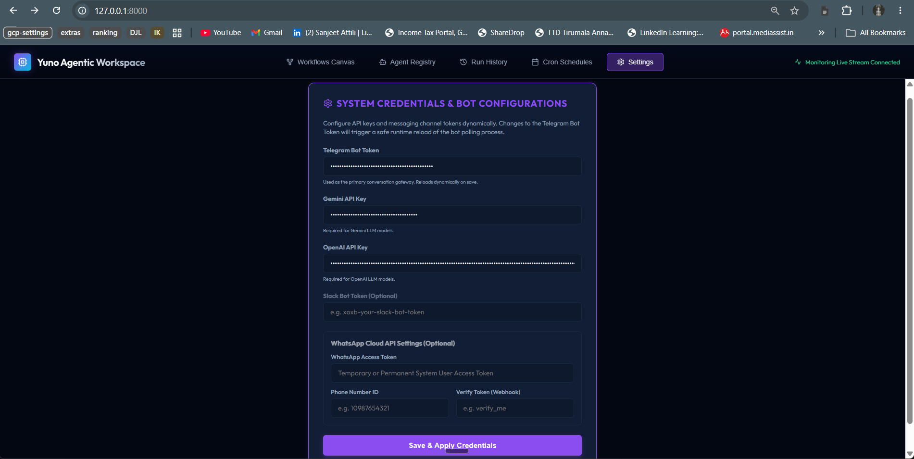

# Yuno AI — Agent Orchestration Platform

> Submission for the Yuno AI Engineer Hiring Challenge — AI Agent Orchestration Platform.

An autonomous, self-hostable AI Agent Orchestration Platform built using **FastAPI** (Python), **LangGraph**, and **React Flow** (React/Vite).

Users can visually design agents, attach specialized tools, configure safety guardrails/interaction limits, and link them into collaborative graphs (featuring conditional branches, triage routes, and parallel execution). The platform executes workflows in real-time, streaming token metrics, USD execution costs, and agent thought trace logs directly to the browser via WebSockets.

---

## 📺 Live Demo
> [!NOTE]
> *Placeholder for the project Loom screen recording. The demo walkthrough will demonstrate:*
> 1. Editing and creating agents / workflow templates visually in the workspace.
> 2. Executing the **AI News Digest** scheduler and monitoring its logs in real-time.
> 3. Connecting to the Telegram Bot, typing `/agent`, `/reset`, and interacting live.

---

## 🏗️ System Architecture

```
                                     +----------------------+
                                     |      Web Browser     |
                                     | (React + React Flow  |
                                     |    + Tailwind CSS)   |
                                     +-----------+----------+
                                                 | REST + WebSocket
                                                 v
 +-----------------------------------------------------------------+
 |                       FastAPI Application                       |
 |                                                                 |
 |  +-------------+   +--------------+   +-----------------------+ |
 |  |   Routers   |   |  WebSocket   |   |  Telegram Bot Gateway | |
 |  |  /api/...   |   | /ws/monitor  |   |    (long polling)     | |
 |  +------+------+   +------+-------+   +-----------+-----------+ |
 |         |                 |                       |             |
 |         v                 v                       v             |
 |  +-----------------------------------------------------------+  |
 |  |  Workflow Orchestrator (backend/runtime/executor.py)      |  |
 |  |    - maps nodes/edges into LangGraph StateGraph           |  |
 |  |    - handles branching / conditions / triages             |  |
 |  |    - pipes node outputs -> next node perception memory    |  |
 |  +-------------------------+---------------------------------+  |
 |                            v                                    |
 |  +-----------------------------------------------------------+  |
 |  |  Agent Runtime (backend/runtime/executor.py & tools.py)    |  |
 |  |    - LangGraph StateGraph + LLMs (Gemini/OpenAI)          |  |
 |  |    - Multi-turn sequential tool calling loops             |  |
 |  |    - Execution cost ($/M tokens) & thought token tracking |  |
 |  |    - Context rolling windows + rolling history compaction  |  |
 |  +-------------------------+---------------------------------+  |
 |                            v                                    |
 |  +-----------------------------------------------------------+  |
 |  |  Persistence (SQLModel + SQLite: orchestrator.db)          |  |
 |  |  tables: agents, workflows, runs, logs, schedules, msgs   |  |
 |  +-----------------------------------------------------------+  |
 +-----------------------------------------------------------------+
                                      ^
                                      | HTTPS
                              +-------+--------+
                              |    Telegram    |
                              |  (user chat)   |
                              +----------------+
```

---

## 🛠️ Tech Stack & Justifications

| Decision | Choice | Why |
| :--- | :--- | :--- |
| **Language (Backend)** | **Python 3.10+** | Rich AI/LLM ecosystem. Native compatibility with LangGraph, SQLModel, and asynchronous packages like `python-telegram-bot`. |
| **Agent Framework** | **LangGraph** | Enables stateful multi-agent workflows, loops, and conditional branching as a native directed acyclic graph (DAG), which aligns perfectly with the hiring challenge's visual builder specs. |
| **LLM Providers** | **Gemini, OpenAI** | Support for premium model suites. Configurable dynamically per-agent in the workspace so users can utilize the best model for each task (e.g. Gemini for search tools, GPT-4o for complex triage). |
| **Web Framework** | **FastAPI** | Async-first performance, perfect for streaming token logs/cost tracking via WebSockets and handling background scheduler operations simultaneously. |
| **Persistence** | **SQLModel + SQLite** | Local file-based SQLite database (`orchestrator.db`) ensures zero-config local runs. Enabling Write-Ahead Logging (WAL) handles high concurrent read/write transactions smoothly. |
| **Frontend** | **React (Vite) + React Flow** | React Flow provides a premium, responsive drag-and-drop workspace for designing agent graph topologies. Compiled static assets are served directly from the FastAPI backend. |
| **Messaging Channel** | **Telegram (python-telegram-bot)** | Fully integrated messaging bot. Provides instant multi-turn agent chats without business verifications (WhatsApp) or workspace setups (Slack). |

---

## 🗂️ Clean Separation of Layers

| Layer | Responsibility | Files & Directories |
| :--- | :--- | :--- |
| **UI Workspace** | Modern React (Vite) interface, utilizing React Flow for node-link diagrams, custom glassmorphism style rules, WebSocket telemetry listeners. | [frontend/src/App.jsx](file:///c:/Users/aksha/OneDrive/Documents/ai-agent-orchestration/frontend/src/App.jsx), [frontend/src/index.css](file:///c:/Users/aksha/OneDrive/Documents/ai-agent-orchestration/frontend/src/index.css) |
| **API Routers** | FastAPI endpoints handling REST CRUD operations for agents, workflows, schedules, and WebSocket monitoring streams. | [backend/main.py](file:///c:/Users/aksha/OneDrive/Documents/ai-agent-orchestration/backend/main.py) |
| **Orchestrator** | Dynamic LangGraph compiler that maps visual node connections into a StateGraph, managing state, reducers, and flow transitions. | [backend/runtime/executor.py](file:///c:/Users/aksha/OneDrive/Documents/ai-agent-orchestration/backend/runtime/executor.py) |
| **Agent Runtime** | LLM factory client instantiation (Gemini, OpenAI, Anthropic), conversational agent logic, rolling window memory compaction, and citation formatting. | [backend/runtime/executor.py](file:///c:/Users/aksha/OneDrive/Documents/ai-agent-orchestration/backend/runtime/executor.py) |
| **Tools Registry** | Integrations for external agent actions (DuckDuckGo Search/Scrape, AST-safe Calculator, Weather Geocoding, Sandboxed File Workspace). | [backend/runtime/tools.py](file:///c:/Users/aksha/OneDrive/Documents/ai-agent-orchestration/backend/runtime/tools.py) |
| **Messaging Gateway** | Multi-channel messaging handlers, featuring a long-polling Telegram bot worker and webhook endpoints for Slack and WhatsApp. | [backend/runtime/channels.py](file:///c:/Users/aksha/OneDrive/Documents/ai-agent-orchestration/backend/runtime/channels.py) |
| **Data Layer** | SQLite database connection setups, database model definitions, and automatic seeding scripts. | [backend/db/models.py](file:///c:/Users/aksha/OneDrive/Documents/ai-agent-orchestration/backend/db/models.py), [backend/db/seed.py](file:///c:/Users/aksha/OneDrive/Documents/ai-agent-orchestration/backend/db/seed.py) |

---

## 🚀 Quick Start (Single-Command Local Run)

### Prerequisites
* Python 3.10+ installed
* Node.js (with `npm`) installed

### 🤖 How to Obtain a Telegram Bot Token

The primary messaging gateway for interactive agent collaboration requires a Telegram Bot token. If you do not have one, follow these quick steps to get one for free:

1. Open your Telegram app, search for the official **`@BotFather`** account, and start a chat.
2. Send the `/newbot` command to `@BotFather`.
3. Enter a friendly display name for your bot (e.g., `My Agent Orchestrator`).
4. Enter a unique username for your bot ending in `bot` (e.g., `my_agent_platform_bot`).
5. `@BotFather` will reply with a message containing your HTTP API token (e.g., `123456789:ABCdefGhIJKlmNoPQRsTUVwxyZ`). Copy this token.
6. Paste the token into your `.env` file as `TELEGRAM_BOT_TOKEN`, or save it directly in the UI under the **Settings** tab after launching the application.

### Setup & Run
1. Clone this repository and open the project workspace.
2. Create a `.env` file in the root directory and add your API credentials:
   ```env
   # LLM Keys
   GEMINI_API_KEY=your_gemini_api_key
   OPENAI_API_KEY=your_openai_api_key
   
   # Telegram Bot (Primary messaging channel)
   TELEGRAM_BOT_TOKEN=your_telegram_bot_token
   ```
   *(Alternatively, if you prefer a UI-first setup, you can leave these blank in the `.env` file and configure them directly under the **Settings** tab in the Web UI after booting).*

   

3. Run the bootloader script from the project root:
   ```bash
   python run.py
   ```
   *This script automatically checks and installs Python libraries, resolves npm modules, compiles frontend static assets, migrates/seeds the database, and boots the FastAPI server.*
4. Open the Web UI in your browser at: **`http://localhost:8000`**

*(For active hot-reloading development where frontend changes refresh automatically, run `python run.py --dev` to launch Vite on `3000` and Uvicorn on `8000` concurrently).*

---

## 🧪 Running the Test Suite

The platform's critical execution paths are guarded by **27 comprehensive unit tests**. Run the test suite locally with:

```bash
pytest backend/tests
```

### Test Coverage Categories
* **🗄️ Database & SQLModel Persistence**: CRUD operations for agents, visual workflows (nodes/edges layout), conversation history retention, and system settings.
* **📈 Token Tracking & Cost Calculation**: Verifies cost computations per provider (OpenAI, Gemini), aggregation of session stats, and Chain-of-Thought/reasoning (thought tokens) support.
* **🛡️ Safety Guardrails & Limits**: Enforces constraints such as maximum tool turn limits, jailbreak/prompt injection detection, and conversation history compaction thresholds.
* **🛠️ Tool Execution & Sandbox Checks**: Validates AST-safe math calculators, directory-restricted local workspace file sandbox operations, and mock weather geocoding.
* **🔗 Dynamic Orchestration & StateGraph Routing**: Tests LangGraph dynamic state reducers, conditional edge expression matching, semantic triage nodes, and active run cancellation.
* **🔌 REST API Endpoint Controllers**: Validates settings endpoints and background APScheduler job synchronization.

---

## 🏗️ Adding Templates or Channels

### 📋 Predefined Seeded Workflows

The platform database is automatically pre-seeded with three battle-tested multi-agent template graphs on startup (configured in [seed.py](file:///c:/Users/aksha/OneDrive/Documents/ai-agent-orchestration/backend/db/seed.py)):

1. **Smart Support Escalation Router**
   * **Purpose**: Demonstrates semantic triage, conditional branching, and escalation logic.
   * **Flow**: Telegram Trigger ➡️ Triage Classifier (checks if query is support-related) ➡️ (If support) Technical Support Agent ➡️ Condition Gate (checks if issue requires Tier-2 escalation) ➡️ Telegram Reply (Escalated notice or direct resolution). Non-support queries are sent to a general log archive action.
2. **AI News Digest**
   * **Purpose**: Demonstrates sequential multi-agent orchestration, web search tools, and scheduling.
   * **Flow**: Telegram Trigger / APScheduler Trigger ➡️ AI News Collector Agent (gathers tech news using search tool) ➡️ AI News Summarizer Agent (compiles bulleted markdown digest) ➡️ Post to Telegram Action.
3. **Parallel Travel Planner**
   * **Purpose**: Demonstrates asynchronous, parallel multi-agent collaboration and consolidation.
   * **Flow**: Telegram Trigger ➡️ Splits concurrently into two parallel execution branches:
     * Branch A: Weather Expert Agent (queries weather tool)
     * Branch B: Local Tour Guide Agent (queries search tool for local sights)
     * ➡️ Consolidates into Travel Coordinator Agent (compiles weather + attractions into a unified 3-day itinerary) ➡️ Send Telegram Reply Action.

---

### 1. Adding a New Workflow Template

The platform supports adding new workflow designs either visually through the browser workspace or programmatically in the codebase.

#### 🎨 The UI Way (Visual Canvas)
1. **Navigate**: Go to the **Design Workspace** tab in the Web UI.
2. **Assemble**: Drag nodes onto the canvas (Triggers, Agents, Actions, and Conditions).
3. **Connect**: Link node handles together to define flow progression and conditional branching paths.
4. **Persist**: Click **Save Workflow**, name your design, and it will immediately become available to run or schedule.

#### 💻 The Code Way (Database Seeding)
1. **Open Seeder**: Open [seed.py](file:///c:/Users/aksha/OneDrive/Documents/ai-agent-orchestration/backend/db/seed.py).
2. **Define Nodes & Edges**: Set up lists representing the React Flow JSON graph structures:
   ```python
   nodes = [
       {"id": "trigger_1", "type": "trigger", "data": {"type": "telegram"}},
       {"id": "agent_1", "type": "agent", "data": {"agent_id": 1}}
   ]
   edges = [
       {"id": "e1-edge", "source": "trigger_1", "target": "agent_1"}
   ]
   ```
3. **Save Record**: Insert and commit a new `Workflow` object in the database inside the `seed_database()` function:
   ```python
   custom_workflow = Workflow(
       name="My Programmatic Flow",
       description="Seeded agent workflow template",
       nodes=nodes,
       edges=edges
   )
   db.add(custom_workflow)
   ```
4. **Boot**: Run `python run.py` to auto-execute the database seeder and register the workflow in the backend database.


### 2. Connecting & Managing Messaging Channels

#### 🟢 Telegram (Fully Battle-Tested)
Telegram bot integrations are fully supported out-of-the-box using the built-in long-polling client.
1. **Get Bot Token from `@BotFather`**:
   * Open the Telegram app, search for the official **`@BotFather`** account, and start a chat.
   * Send the `/newbot` command.
   * Choose a friendly name for your bot (e.g., `My Orchestration Agent`).
   * Choose a unique username ending in `bot` (e.g., `my_agent_platform_bot`).
   * `@BotFather` will reply with your API token (e.g., `123456789:ABCdefGhIJKlmNoPQRsTUVwxyZ`). Copy this token.
2. **Configure Settings**: Go to the **Settings** tab in the UI, input your token under **Telegram Bot Token**, and click save. The backend dynamically reloads and boots the polling worker.
3. **Connect to bot**: Open your bot on Telegram, send **/start** to retrieve your unique **Chat ID**.
4. **Link schedules**: Paste this Chat ID into any schedule registration form in the UI. When scheduled cron tasks run in the background (e.g. news digests), they will directly message you.

#### 🟡 Slack & WhatsApp (Optional / Infrastructure Code Ready)
Webhooks for Slack and WhatsApp Meta Graph APIs are implemented in [channels.py](file:///c:/Users/aksha/OneDrive/Documents/ai-agent-orchestration/backend/runtime/channels.py).
1. Configure a public tunnel to direct incoming requests to your local instance:
   ```bash
   ngrok http 8000
   ```
2. **Slack Webhook Hook:** Set the **Event Subscriptions Request URL** in the Slack App Portal to `https://<ngrok-url>/api/webhooks/slack` and subscribe to `app_mention` messages.
3. **WhatsApp Webhook Hook:** Set the **Meta Webhook Callback URL** to `https://<ngrok-url>/api/webhooks/whatsapp` and configure your verification token.

---

## 🧠 Memory, Configuration & Telegram Commands

To deliver a production-grade multi-agent experience, the platform incorporates a state-of-the-art dual-tiered memory model, fully customizable agents, and interactive controls via Telegram.

### 1. Memory System Architecture

* **Short-Term Conversation History (Context Memory)**:
  * Conversation history is stored in the database's `Message` table.
  * The agent's attention window is bound by its configured `memory_limit` ($K$ turns).
  * **LLM-Based Session Compaction**: Once a session exceeds $K$ turns or 90% of the model's context window, the orchestrator triggers an automatic summarization step. An LLM compresses the older message history into a single cohesive system summary message, deletes the old messages from the database, and preserves the latest 2 turns intact.
* **Long-Term Semantic Memory (Fact Extraction)**:
  * At the end of each workflow run, an asynchronous memory worker (`extract_persistent_workflow_memory`) executes.
  * It reviews the run logs to distill key semantic facts (user configurations, preferences, facts, or parameter states) and saves them to the `AgentMemory` table.
  * These persistent facts are injected automatically back into the agent's context during future runs to give personalized continuity across different sessions.
* **Session Reset (`/reset` Command)**:
  * Users can type `/reset` directly in the Telegram chat to clear both their short-term message history and long-term extracted facts scoped to their active workflow.

### 2. ⚙️ Agent Configurable Dimensions
Each agent configured in the visual design workspace contains the following core parameters:

| Dimension | Description |
| :--- | :--- |
| **`Name`** | The display identifier of the agent (e.g., `Support Specialist`). |
| **`Role`** | The functional role defining the agent's persona and focus (e.g., `Technical Support Expert`). |
| **`System Prompt`** | Main directive and instructions defining the agent's behavior, style, and guardrails. |
| **`Model Provider`** | Selects the LLM client engine (choices: `Gemini` or `OpenAI`). |
| **`Model Name`** | Selects the specific model identifier (e.g., `gemini-2.5-flash`, `gpt-4o-mini`, `gpt-4o`). |
| **`Memory Limit (K)`** | The conversation turn ceiling before LLM session compaction is triggered. |
| **`Tools`** | Enabled capabilities from the registry (choices: `search`, `weather`, `calculator`, `workspace`). |
| **`Channels`** | Active communication endpoints (e.g., `telegram`). |
| **`Guardrails`** | JSON configured rules defining safety checks or output format constraints. |

### 3. 🤖 Telegram Commands Reference
The Telegram Bot gateway supports the following interactive controls for live users:

| Command | Arguments | Description |
| :--- | :--- | :--- |
| **`/start`** | None | Welcomes the user, explains the bot, and displays their unique **Chat ID** (needed to hook cron schedules). |
| **`/help`** | None | Displays the bot manual and lists all available controls. |
| **`/agent`** | Optional: `[index]` | Without arguments, lists all active workflows in the platform. With an index (e.g., `/agent 1`), switches your active chat session to route all future queries to that workflow. |
| **`/reset`** | None | Clears the chat's message history and persistent long-term memories for the currently active workflow. |
| **`/my_schedules`** | None | Lists all background task triggers registered to deliver updates to this chat ID. |
| **`/enable_schedule`** | `[schedule_id]` | Enables and triggers a background scheduled job by its database ID. |
| **`/disable_schedule`**| `[schedule_id]` | Pauses and disables a background scheduled job by its database ID. |

---

## 🔌 API Endpoints Reference

The backend exposes a clean REST and WebSocket API. The interactive OpenAPI documentation is auto-generated and accessible locally at **`http://localhost:8000/docs`**.

### 🎙️ Live Telemetry
* **`WS /api/ws/monitoring`**: Persistent WebSocket connection to broadcast live execution logs, token usage, cost calculations, and active nodes to visual dashboard clients.

### 🤖 Agents (CRUD)
* **`GET /api/agents`**: Retrieves all configured agents.
* **`POST /api/agents`**: Registers a new agent configuration.
* **`PUT /api/agents/{agent_id}`**: Updates parameters (tools, personality, model, memory limits) for a specific agent.
* **`DELETE /api/agents/{agent_id}`**: Deletes an agent record.

### 🏗️ Workflows & Execution
* **`GET /api/workflows`**: Lists all visual graph templates.
* **`GET /api/workflows/{workflow_id}`**: Returns node and edge connections for a workflow.
* **`POST /api/workflows`**: Registers a new visual workflow graph.
* **`PUT /api/workflows/{workflow_id}`**: Updates a workflow's topology.
* **`DELETE /api/workflows/{workflow_id}`**: Deletes a workflow.
* **`POST /api/workflows/{workflow_id}/run`**: Triggers a manual execution of a workflow run in the background.

### 📊 Run Logs & Memory
* **`GET /api/runs`**: Returns history records for all runs.
* **`GET /api/runs/{run_id}`**: Returns detailed logs and results for a specific execution run.
* **`DELETE /api/runs/{run_id}/cancel`**: Requests cancellation of an active workflow run task.
* **`GET /api/sessions/{session_id}/stats`**: Aggregates token usage, run counts, and execution costs for a given session.
* **`GET /api/workflows/{workflow_id}/memory`**: Lists long-term memories and facts extracted for a workflow.
* **`DELETE /api/workflows/{workflow_id}/memory/{key}`**: Deletes a long-term key-value memory fact.

### 📅 Background Schedules
* **`GET /api/schedules`**: Lists all automated schedules.
* **`POST /api/schedules`**: Creates and activates a new background cron job.
* **`PUT /api/schedules/{schedule_id}`**: Modifies a cron configuration.
* **`DELETE /api/schedules/{schedule_id}`**: De-activates and deletes a scheduled job.

### ⚙️ System Settings & Webhooks
* **`GET /api/settings`**: Retrieves key configurations (keys, tokens) from database records.
* **`POST /api/settings`**: Saves configurations (auto-starts/reloads Telegram bot upon token update).
* **`POST /api/webhooks/slack`**: Webhook gateway receiver for Slack integrations.
* **`GET/POST /api/webhooks/whatsapp`**: Webhook gateway receiver for Meta WhatsApp integrations.

---

## ⚠️ Known Limitations & Production Considerations

1. **Telegram Client-Initiation Restraint**: Bots cannot proactively message a user on Telegram unless the user has first typed `/start` or interacted with the bot. Scheduled cron triggers will fail to deliver messages if the user has not initialized the bot.
2. **In-Process Scheduler (APScheduler)**: The background scheduler runs directly within the main FastAPI application process. If the server is stopped or restarted, scheduled tasks do not execute. There is no external task broker (like Redis/Celery) to coordinate/retry schedules across multiple server instances.
3. **No LLM Request Throttling / Queuing**: External LLM client calls are made immediately. In workflows with intensive parallel nodes or tight tool loops, the platform doesn't queue requests or apply automatic exponential backoffs, making it susceptible to API rate limits (`HTTP 429`).

